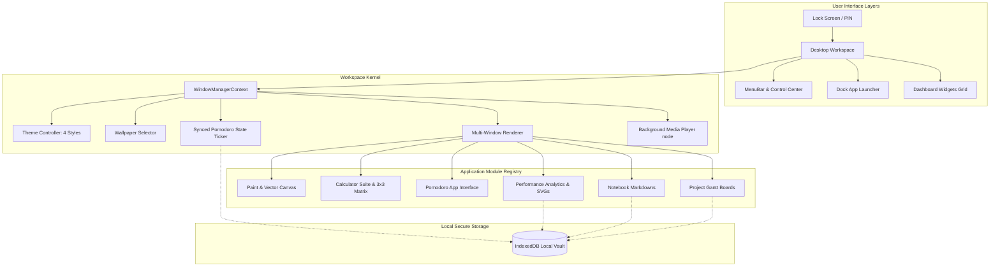

# Lakshay 🎯
### *Futuristic, Offline-First Student Productivity OS*

[](https://reactjs.org/)
[](https://www.typescriptlang.org/)
[](https://vite.dev/)
[](https://developer.mozilla.org/en-US/docs/Web/API/IndexedDB_API)
[](https://developer.mozilla.org/en-US/docs/Web/API/Web_Audio_API)

**Lakshay** (meaning *Goal* in Sanskrit) is a high-fidelity desktop workspace dashboard designed to make the daily study hustle of students structured, visual, and entirely distraction-free. By operating completely local-first on the user's browser, Lakshay guarantees total privacy, latency-free rendering, and uninterrupted offline access.

---

## 🏗️ Architecture Design

The following Mermaid diagram illustrates the global state system, browser storage layers, and interactive client widgets in the Lakshay environment:



---

## ✨ Primary Features

### 1. 🍅 Real-time Synced Study Timer (Pomodoro)
*   **Decoupled State Ticker**: The countdown mechanics are hosted directly in the global `WindowManagerContext`. Ticking continues flawlessly when application windows are minimized or closed.
*   **Dual View Syncing**: The fullscreen Pomodoro module and the quick desktop widget remain synchronized. Pausing, resuming, resetting, or modifying interval configurations in one view reflects in the other instantly.
*   **Self-Healing Analytics**: Ticker auto-records completed study blocks directly to the local IndexedDB. A self-healing parser detects legacy log metrics and scales durations safely to prevent analytics skew.

### 2. 🎨 Paint & Drawing Suite (Rich Vector Canvas)
*   **Declarative Vector Shapes Store**: Renders drawings dynamically from a shape state array instead of standard pixel raster coordinates, allowing undo/redo steps, smooth resizing, and translations.
*   **Multi-Shape Translations**: Select multiple items using Shift-Click or a Marquee selection box, and translate or drag them simultaneously.
*   **Resize Handles**: Drag corners (`nw`, `ne`, `sw`, `se`) of drawn shapes, straight lines, ellipses, or text box frames to rescale shapes or font sizes.
*   **Transparent Direct Text Inputs**: Place a text field directly onto canvas coordinate positions with automated focus delays to prevent premature blur closures.
*   **Symmetric Classic Bezier Hearts**: Generates symmetric double-loop Bezier curves that render perfectly regardless of the drag direction (e.g., bottom-to-top or right-to-left).
*   **Accurate Heart Boundary Clicks**: Boundary click-checking samples the Bezier heart curves at key intervals, restricting selection clicks to the heart's outline.
*   **14 Creative Tools**: Supports Pencil (freehand), Eraser, Straight Line, Arrow, Rectangle, Ellipse, Triangle, Right Triangle, Diamond, Star, Pentagon, Hexagon, Heart, and Text boxes.

### 3. 🧮 Calculator Suite
*   **3x3 Matrix Calculator**: Compute matrix determinants ($\text{det}(A) = a(ei - fh) - b(di - fg) + c(dh - eg)$) and transpositions dynamically with auto-scaling grids.
*   **Radix Alphanumeric Filter**: Automatically validates input values dynamically (e.g., binary only allows `0-1`, hex restricts inputs to `0-9, A-F`), blocking letters or symbols.
*   **Glow Keyboard Feedback**: Intercepts keyboard events to trigger clicking animations and glow overlays on the on-screen buttons.
*   **Overflow Display Scrolling**: Scientific displays support horizontal scrolling to handle large equations cleanly.

### 4. 📊 Performance Analytics & Dashboard Charts
*   **Interactive SVG Hover Tooltips**: Moving the cursor over lines or bars expands markers and spawns floating tooltips displaying exact study session logs.
*   **24-Hour Scaling Y-Axis**: Weekly study charts scale automatically relative to a realistic 24-hour limit.

### 5. 🎧 Control Center Media Player
*   **Local Media Deck**: Upload multiple files (MP3, MP4, M4A, WAV) or folder hierarchies directly from your local filesystem.
*   **Audio Persistence**: Decouples the `<audio>` node from the settings menu. Music continues playing in the background even if you close the Control Center settings overlay.
*   **Ambient Synthesizer**: Focus-optimized white noise and brown noise synthesizers (Rain, Ocean Waves, Focus static) run locally.

### 6. 💫 Premium Animation System
*   **Pulsing Window Shadows**: Active windows pulse subtle glow highlights in a loop (`focusPulse`) to emphasize active windows.
*   **Taskbar Dock Spring Bounces**: Clicking a dock shortcut temporarily compresses its scale before restoring it, mimicking responsive physical button feedback.
*   **Control Center and Search Open Transitions**: Smooth entry animations slide search overlays and settings menus into view.

---

## 🚀 Getting Started

### Prerequisites
Make sure you have [Node.js](https://nodejs.org/) installed.

### Installation
1. Clone this repository locally:
   ```bash
   git clone https://github.com/YOUR_USERNAME/Lakshay.git
   cd Lakshay
   ```
2. Install dependencies:
   ```bash
   npm install
   ```
3. Run the development server:
   ```bash
   npm run dev
   ```
4. Build for production:
   ```bash
   npm run build
   ```

---

## 📂 Project Structure
*   `src/components/windowmanager/`: Taskbars, Docks, Window managers, Desktop grids, and widgets.
*   `src/context/`: Global states, theme manager, and synchronized background clock.
*   `src/db/`: Offline IndexedDB schemas and data hooks.
*   `src/modules/`: Application tools including Paint, Pomodoro, Notebook, and GPA Calculators.
*   `src/utils/`: Audio Synthesizers and helper functions.
